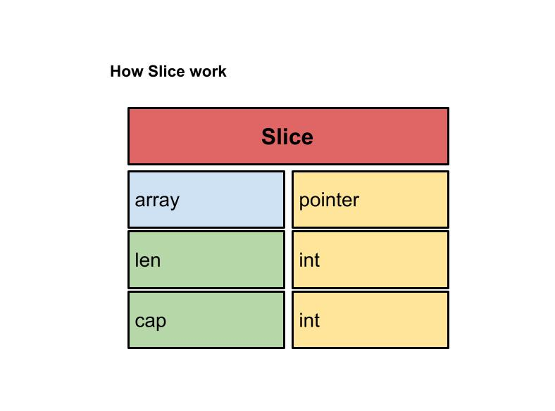
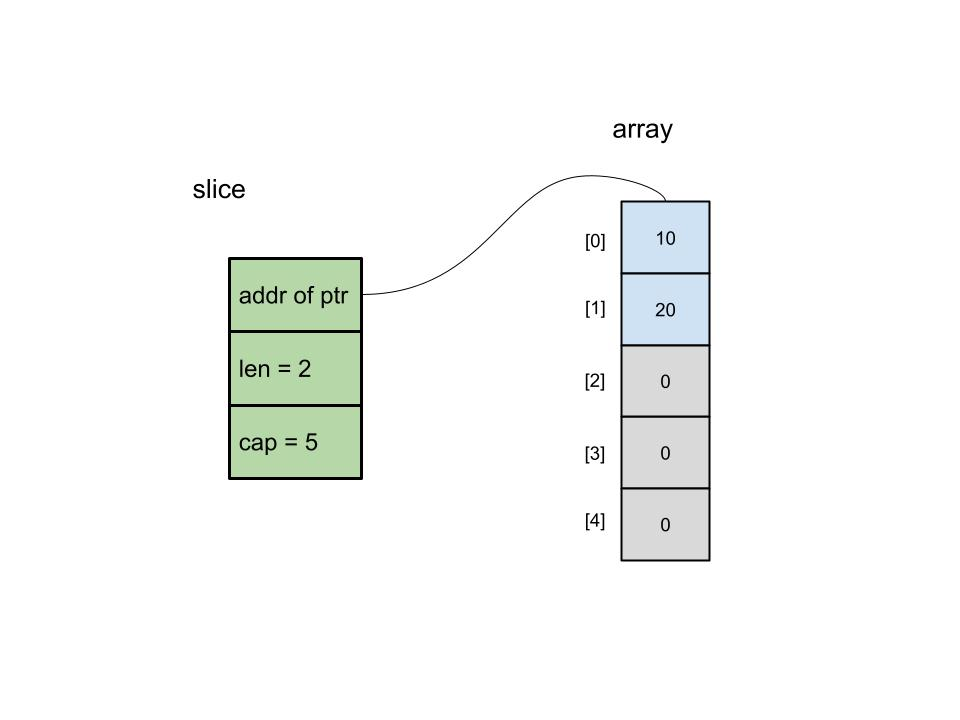
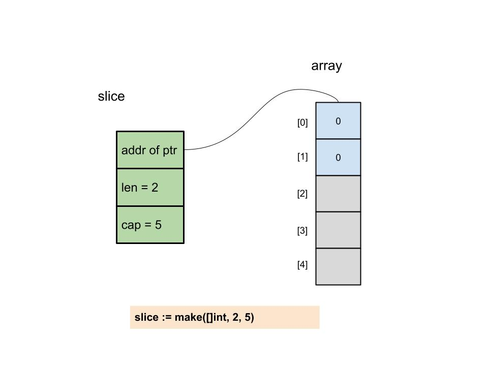
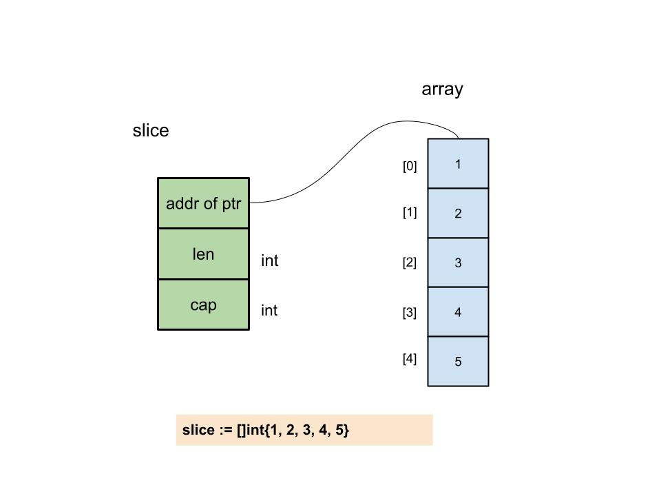
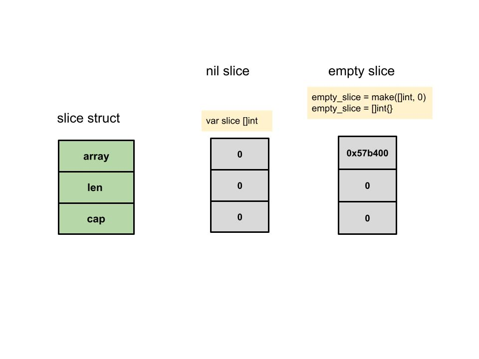
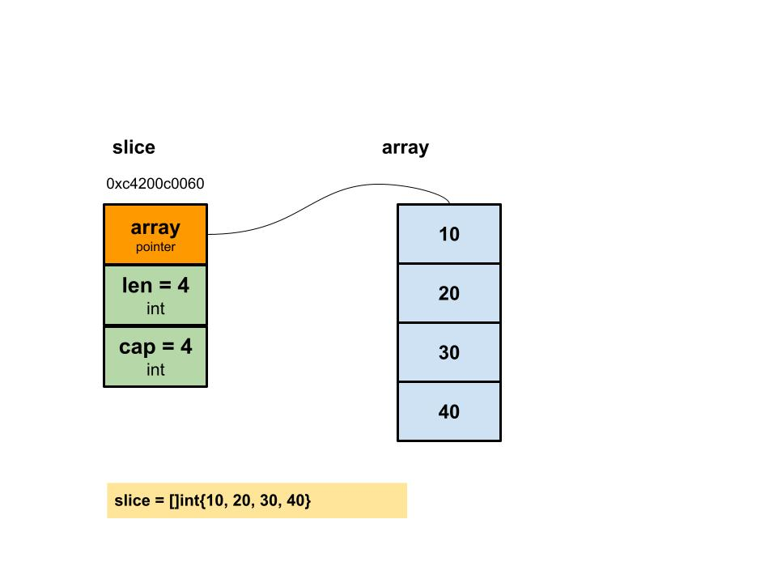
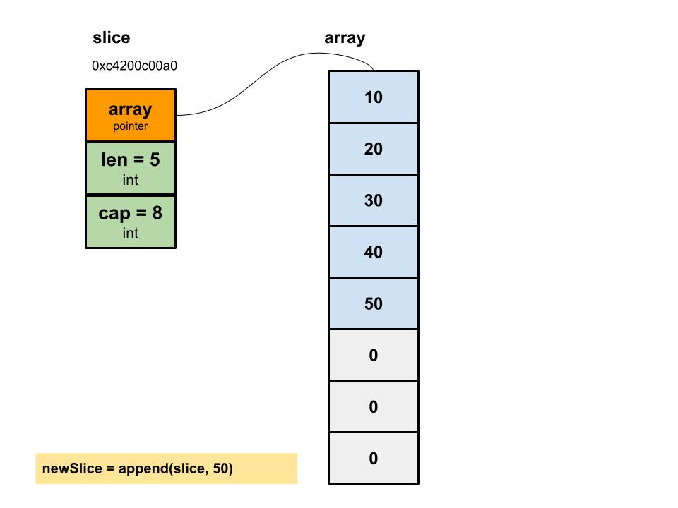
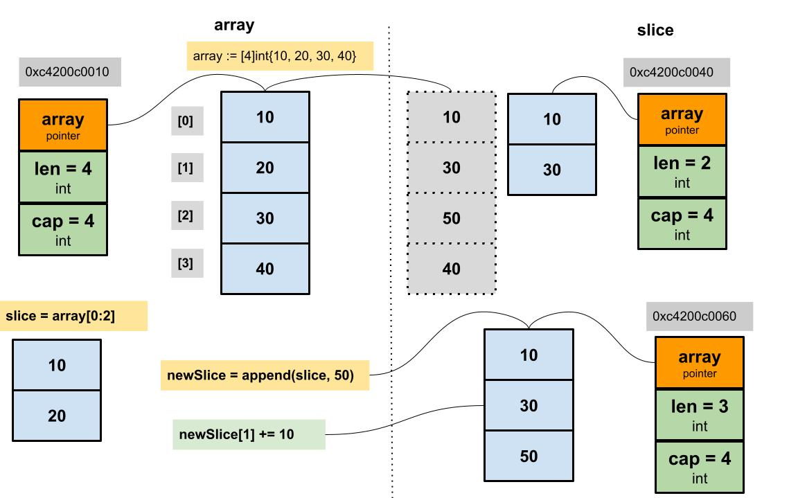
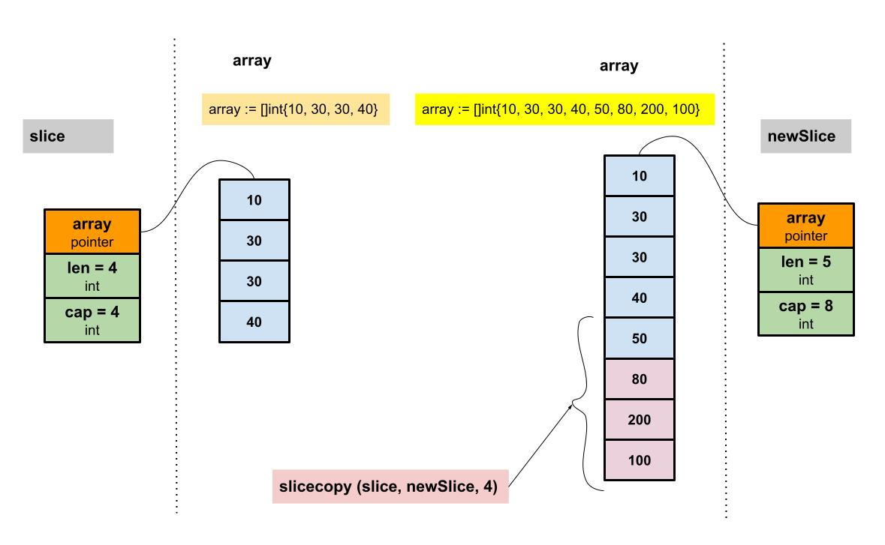
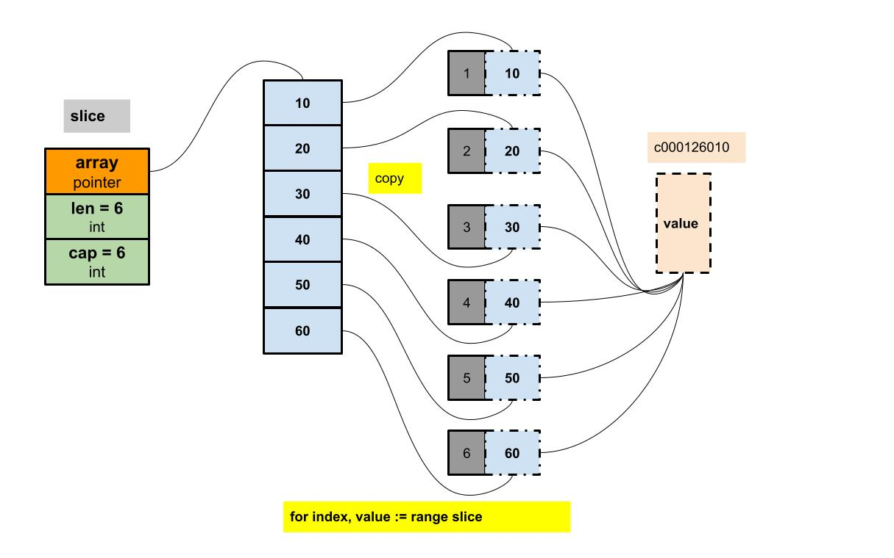

## Difference between slices and arrays

Arrays, after declared of some size, cannot be resized, but  slices  can be resized. Slices are reference-types while arrays are value-type.

An example :

```go
func testArray(x [2]int)  {
   fmt.Printf("func Array : %p, %v\n", &x, x)
}

func main()  {
   arrayA := [2]int{100, 200}
   var arrayB [2]int

   arrayB = arrayA

   fmt.Printf("ArrayA : %p, %v\n", &arrayA, arrayA)
   fmt.Printf("ArrayB : %p, %v\n", &arrayB, arrayB)

   testArray(arrayA)

}
```

```go
ArrayA : 0xc0000200c0, [100 200]
ArrayB : 0xc0000200d0, [100 200]
func Array : 0xc000020110, [100 200]
```

The three memory addresses (`0xc0000200c0`,`0xc0000200d0`,`0xc000020110`)  are all different, which verifies that array assignment and function parameter transfer in Go are all copied by value.


## How Slice work

Slices are resizable arrays that provide huge flexibility when working  with it. In this post, we will see how to use slices in GoLang.

Slices are the  constructs in Go which give us the flexibility to work with dynamically  sized collections. A slice is an abstraction of an array, and it points  to a contiguous section of an array stored separately from the slice  variable itself. Internally, a slice is a descriptor which holds the  following values:

- pointer to the backing array (actually, pointer to the array value  which indicates 0th index of the slice, which we will cover later)
- the length of the segment it's referring to
- its capacity (the maximum length of the segment)

```go
type slice struct {
	array unsafe.Pointer
	len   int
	cap   int
}
```




The slice structure consists of three parts, `pointer` is a pointer to an array, `len` represents the length of the current slice, and `cap` is the capacity of the current slice.`cap` is almost bigger than `len`.



## How to make slice

```go
var slice_name []type
```

Different way to make slice :

```go
func main() {
	var a []int 
	b := []int{}
	c := make([]int, 0)
	fmt.Printf("a: %v, len %d, cap: %d\n", a, len(a), cap(a))
	fmt.Printf("b: %v, len %d, cap: %d\n", b, len(b), cap(b))
	fmt.Printf("c: %v, len %d, cap: %d\n", c, len(c), cap(c))
}
```

```go
a: [], len 0, cap: 0
b: [], len 0, cap: 0
c: [], len 0, cap: 0
```


You can also initialize a slice with seed values, and the length of the  values here will also be the capacity of the backing array:


```go
func main() {
	a := []int{1,2,3}
	fmt.Printf("a: %v, len %d, cap: %d\n", a, len(a), cap(a))
}
```

```go
a: [1 2 3], len 3, cap: 3
```


In case you know the maximum capacity that a slice can grow to, it's  best to initialize the slice by hinting the capacity so that you don't  have to grow the backing array as you add new values to slice (which we  will see how to in the next section). You can do so by passing it to the `make`  builtin function.


```go
func main() {
	a := make([]int, 0, 10)
	fmt.Printf("a: %v, len %d, cap: %d\n", a, len(a), cap(a))
}
```

```go
a: [], len 0, cap: 10
```


### make slice and slice literal

```go
func makeslice(et *_type, len, cap int) slice {
	// 根据切片的数据类型，获取切片的最大容量
	maxElements := maxSliceCap(et.size)
    // 比较切片的长度，长度值域应该在[0,maxElements]之间
	if len < 0 || uintptr(len) > maxElements {
		panic(errorString("makeslice: len out of range"))
	}
    // 比较切片的容量，容量值域应该在[len,maxElements]之间
	if cap < len || uintptr(cap) > maxElements {
		panic(errorString("makeslice: cap out of range"))
	}
    // 根据切片的容量申请内存
	p := mallocgc(et.size*uintptr(cap), et, true)
    // 返回申请好内存的切片的首地址
	return slice{p, len, cap}
}
```


There is also an `int64` version :

```go
func makeslice64(et *_type, len64, cap64 int64) slice {
	len := int(len64)
	if int64(len) != len64 {
		panic(errorString("makeslice: len out of range"))
	}

	cap := int(cap64)
	if int64(cap) != cap64 {
		panic(errorString("makeslice: cap out of range"))
	}

	return makeslice(et, len, cap)
}
```


The implementation principle is the same as the above, except that there is an extra step of converting `int64` to `int`.




The figure above is a slice with `len = 2` and `cap = 5` created by the make function. The memory space has applied for 5 memory sizes of int type. Since `len = 2`, the latter two cannot be accessed temporarily, but the capacity is still there. At this time, every variable in the array is `0`.

In addition to the make function that can create slices, literals can also create slices.




Here is a slice with `len = 5 ` and `cap = 5 ` created with literals. At this time, the value of each element in the array is initialized. **It should be noted that the capacity of the array should not be written in []**, because if the number is written, it will be an **array** instead of a **slice**.


### nil slice and empty slice

```go
// nil slice
var slice []int
//empty slice
empty_slice = make([]int, 0)
empty_slice = []int{}
```




The last point that needs to be explained is  whether you use nil slices or empty slices, call the built-in function append to it, and the effects of len and cap are the same.


### append slice 

When the capacity of a slice is full, it needs to be expanded. How to expand, what is the strategy ?

```go
func growslice(et *_type, old slice, cap int) slice {
	if raceenabled {
		callerpc := getcallerpc(unsafe.Pointer(&et))
		racereadrangepc(old.array, uintptr(old.len*int(et.size)), callerpc, funcPC(growslice))
	}
	if msanenabled {
		msanread(old.array, uintptr(old.len*int(et.size)))
	}

	if et.size == 0 {
		// 如果新要扩容的容量比原来的容量还要小，这代表要缩容了，那么可以直接报panic了。
		if cap < old.cap {
			panic(errorString("growslice: cap out of range"))
		}

		// 如果当前切片的大小为0，还调用了扩容方法，那么就新生成一个新的容量的切片返回。
		return slice{unsafe.Pointer(&zerobase), old.len, cap}
	}

    // 这里就是扩容的策略
	newcap := old.cap
	doublecap := newcap + newcap
	if cap > doublecap {
		newcap = cap
	} else {
		if old.len < 1024 {
			newcap = doublecap
		} else {
			// Check 0 < newcap to detect overflow
			// and prevent an infinite loop.
			for 0 < newcap && newcap < cap {
				newcap += newcap / 4
			}
			// Set newcap to the requested cap when
			// the newcap calculation overflowed.
			if newcap <= 0 {
				newcap = cap
			}
		}
	}

	// 计算新的切片的容量，长度。
	var lenmem, newlenmem, capmem uintptr
	const ptrSize = unsafe.Sizeof((*byte)(nil))
	switch et.size {
	case 1:
		lenmem = uintptr(old.len)
		newlenmem = uintptr(cap)
		capmem = roundupsize(uintptr(newcap))
		newcap = int(capmem)
	case ptrSize:
		lenmem = uintptr(old.len) * ptrSize
		newlenmem = uintptr(cap) * ptrSize
		capmem = roundupsize(uintptr(newcap) * ptrSize)
		newcap = int(capmem / ptrSize)
	default:
		lenmem = uintptr(old.len) * et.size
		newlenmem = uintptr(cap) * et.size
		capmem = roundupsize(uintptr(newcap) * et.size)
		newcap = int(capmem / et.size)
	}

	// 判断非法的值，保证容量是在增加，并且容量不超过最大容量
	if cap < old.cap || uintptr(newcap) > maxSliceCap(et.size) {
		panic(errorString("growslice: cap out of range"))
	}

	var p unsafe.Pointer
	if et.kind&kindNoPointers != 0 {
		// 在老的切片后面继续扩充容量
		p = mallocgc(capmem, nil, false)
		// 将 lenmem 这个多个 bytes 从 old.array地址 拷贝到 p 的地址处
		memmove(p, old.array, lenmem)
		// 先将 P 地址加上新的容量得到新切片容量的地址，然后将新切片容量地址后面的 capmem-newlenmem 个 bytes 这块内存初始化。为之后继续 append() 操作腾出空间。
		memclrNoHeapPointers(add(p, newlenmem), capmem-newlenmem)
	} else {
		// 重新申请新的数组给新切片
		// 重新申请 capmen 这个大的内存地址，并且初始化为0值
		p = mallocgc(capmem, et, true)
		if !writeBarrier.enabled {
			// 如果还不能打开写锁，那么只能把 lenmem 大小的 bytes 字节从 old.array 拷贝到 p 的地址处
			memmove(p, old.array, lenmem)
		} else {
			// 循环拷贝老的切片的值
			for i := uintptr(0); i < lenmem; i += et.size {
				typedmemmove(et, add(p, i), add(old.array, i))
			}
		}
	}
	// 返回最终新切片，容量更新为最新扩容之后的容量
	return slice{p, old.len, newcap}
}
```

The above is the realization of expansion. There are two main points to pay attention to. One is the strategy for expansion, and the other is whether the expansion is to generate a new memory address or append to the original address.

#### 1. Expansion strategy

Here an example :

```go
func main() {
	slice := []int{10, 20, 30, 40}
	newSlice := append(slice, 50)
	fmt.Printf("Before slice = %v, Pointer = %p, len = %d, cap = %d\n"slice, &slice, len(slice), cap(slice))
	fmt.Printf("Before newSlice = %v, Pointer = %p, len = %d, cap = %d\n",newSlice, &newSlice, len(newSlice), cap(newSlice))
	newSlice[1] += 10
	fmt.Printf("After slice = %v, Pointer = %p, len = %d, cap = %d\n",slice, &slice, len(slice), cap(slice))
	fmt.Printf("After newSlice = %v, Pointer = %p, len = %d, cap = %d\n",newSlice, &newSlice, len(newSlice), cap(newSlice))
}
```

```go
Before slice = [10 20 30 40], Pointer = 0xc4200b0140, len = 4, cap = 4
Before newSlice = [10 20 30 40 50], Pointer = 0xc4200b0180, len = 5, cap = 8
After slice = [10 20 30 40], Pointer = 0xc4200b0140, len = 4, cap = 4
After newSlice = [10 30 30 40 50], Pointer = 0xc4200b0180, len = 5, cap = 8
```







From the figures, we can easily see that the new slice is different from the previous slice because the new slice changes a value and does not affect the original array. The array pointed to by the new slice is a brand new array. And the cap capacity has also changed. What happened in between ?

The strategy of slice expansion in Go is as follow. :

- First  if the newly applied capacity (cap) is greater than 2 times the old capacity (old.cap), the final capacity (newcap) is the newly applied capacity (cap)
- Otherwise, if the length of the old slice is less than 1024, the final capacity (newcap) is twice the old capacity (old.cap), ie (newcap=doublecap)
- Otherwise, if the length of the old slice is greater than or equal to 1024, the final capacity (newcap) starts from the old capacity (old.cap) and increases by 1/4 of the original cyclically, that is (newcap=old.cap,for {newcap += newcap/4 }) Until the final capacity (newcap) is greater than or equal to the newly applied capacity (cap), ie (newcap >= cap)
- If the final capacity (cap) calculation value overflows, the final capacity (cap) is the newly applied capacity (cap)


**Note: The expanded capacity is based on the original capacity, not the length of the original array. ** 

#### 2. new slice or old slice ?

Let's talk about the array after expansion must be new one slice ? This is not necessarily true, there are two cases : 

First case :

```go
func main() {
	array := [4]int{10, 20, 30, 40}
	slice := array[0:2]
	newSlice := append(slice, 50)
	fmt.Printf("Before slice = %v, Pointer = %p, len = %d, cap = %d\n", slice, &slice, len(slice), cap(slice))
	fmt.Printf("Before newSlice = %v, Pointer = %p, len = %d, cap = %d\n",newSlice, &newSlice, len(newSlice), cap(newSlice))
	newSlice[1] += 10
	fmt.Printf("After slice = %v, Pointer = %p, len = %d, cap = %d\n",slice, &slice, len(slice), cap(slice))
	fmt.Printf("After newSlice = %v, Pointer = %p, len = %d, cap = %d\n",newSlice, &newSlice, len(newSlice), cap(newSlice))
	fmt.Printf("After array = %v\n", array)
}
```

```go
Before slice = [10 20], Pointer = 0xc4200c0040, len = 2, cap = 4
Before newSlice = [10 20 50], Pointer = 0xc4200c0060, len = 3, cap = 4
After slice = [10 30], Pointer = 0xc4200c0040, len = 2, cap = 4
After newSlice = [10 30 50], Pointer = 0xc4200c0060, len = 3, cap = 4
After array = [10 30 50 40]
```





From the printed results, we can see that in this case, a new array is not created after the expansion, and the arrays before and after the expansion are the same, which also causes the new slice to modify a value, which also affects It's the old slice. And the append() operation also changed the value in the original array. An append() operation affects so many places, if there are multiple slices on the original array, then these slices will all be affected! Inexplicable bugs occurred inadvertently !

In this case, because the original array still has a capacity that can be expanded, after the append() operation is executed, the original array will be operated directly, so in this case, the expanded array still points to the original array.

This situation is also very easy to occur when creating a slice with a literal. When the third parameter cap is passed by value, if the slice is created with a literal, cap is not equal to the total capacity of the array, then this situation will happen.

```go
slice := array[1:2:3]
```

**The above case is very dangerous and extremely prone to bugs.**

It is recommended that when creating slices with literals, the value of cap must be kept awake to avoid bugs caused by sharing the original array.

Second case :

This case is actually an example in the expansion strategy. In that example, a new slice is generated because the original array has reached the maximum capacity. If you want to expand, Go will open a memory area by default. Copy the original value, and then perform the append() operation. This situation does not affect the original array at all.

In fact, it is recommended to avoid case one and use case two as much as possible to avoid bugs.


### copy silce

There are two copy methods in slice .

```go
func slicecopy(to, fm slice, width uintptr) int {
	// 如果源切片或者目标切片有一个长度为0，那么就不需要拷贝，直接 return 
	if fm.len == 0 || to.len == 0 {
		return 0
	}
	// n 记录下源切片或者目标切片较短的那一个的长度
	n := fm.len
	if to.len < n {
		n = to.len
	}
	// 如果入参 width = 0，也不需要拷贝了，返回较短的切片的长度
	if width == 0 {
		return n
	}
	// 如果开启了竞争检测
	if raceenabled {
		callerpc := getcallerpc(unsafe.Pointer(&to))
		pc := funcPC(slicecopy)
		racewriterangepc(to.array, uintptr(n*int(width)), callerpc, pc)
		racereadrangepc(fm.array, uintptr(n*int(width)), callerpc, pc)
	}
	// 如果开启了 The memory sanitizer (msan)
	if msanenabled {
		msanwrite(to.array, uintptr(n*int(width)))
		msanread(fm.array, uintptr(n*int(width)))
	}

	size := uintptr(n) * width
	if size == 1 { 
		// TODO: is this still worth it with new memmove impl?
		// 如果只有一个元素，那么指针直接转换即可
		*(*byte)(to.array) = *(*byte)(fm.array) // known to be a byte pointer
	} else {
		// 如果不止一个元素，那么就把 size 个 bytes 从 fm.array 地址开始，拷贝到 to.array 地址之后
		memmove(to.array, fm.array, size)
	}
	return n
}
```

In this method, the slicecopy method copies the elements in the source slice value (ie fm Slice) to the target slice (ie to Slice) and returns the number of elements copied. The two types of copy must be the same. The final copy result of the slicecopy method depends on the shorter slice. When the shorter slice is copied, the entire copy process is completed.





Here an example :

```go
func main() {
	array := []int{10, 20, 30, 40}
	slice := make([]int, 6)
	n := copy(slice, array)
	fmt.Printf("n = %v ,slice = %v ,len = %v , cap = %v",n,slice,len(slice), 						cap(slice))
}
```

```go
n = 4 ,slice = [10 20 30 40 0 0] ,len = 6 , cap = 6
```


There is also a copy method. The principe of this method is similar to the slicecopy method, so I won't repeat it, you can look for  the comments  written in the code.

```go
func slicestringcopy(to []byte, fm string) int {
	// 如果源切片或者目标切片有一个长度为0，那么就不需要拷贝，直接 return 
	if len(fm) == 0 || len(to) == 0 {
		return 0
	}
	// n 记录下源切片或者目标切片较短的那一个的长度
	n := len(fm)
	if len(to) < n {
		n = len(to)
	}
	// 如果开启了竞争检测
	if raceenabled {
		callerpc := getcallerpc(unsafe.Pointer(&to))
		pc := funcPC(slicestringcopy)
		racewriterangepc(unsafe.Pointer(&to[0]), uintptr(n), callerpc, pc)
	}
	// 如果开启了 The memory sanitizer (msan)
	if msanenabled {
		msanwrite(unsafe.Pointer(&to[0]), uintptr(n))
	}
	// 拷贝字符串至字节数组
	memmove(unsafe.Pointer(&to[0]), stringStructOf(&fm).str, uintptr(n))
	return n
}
```

Another one example :

```go
func main() {
	slice := make([]byte, 3)
	n := copy(slice, "abcdef")
	fmt.Println(n,slice)
}
```

```go
n = 3, slice = [97 98 99] 
```

About  copy slice, there is a problem that needs attention in slice .

```go
func main() {
   slice := []int{10, 20, 30, 40}
   for index, value := range slice {
      fmt.Printf("value = %d , value-addr = %x , slice-addr = %x\n", value, 					&value, &slice[index])
   }
}
```

```go
value = 10 , value-addr = c000126010 , slice-addr = c000132000
value = 20 , value-addr = c000126010 , slice-addr = c000132008
value = 30 , value-addr = c000126010 , slice-addr = c000132010
value = 40 , value-addr = c000126010 , slice-addr = c000132018
```

From the above results, we can see that if you use range to traverse a slice, the Value you get is actually a copy of the value in the slice. In fact, the address of Value will not change every time you print.



Since Value is copied by value, not passed by reference, directly changing Value will not achieve the purpose of changing the original slice value. You need to get the real address through `&slice[index]`.


